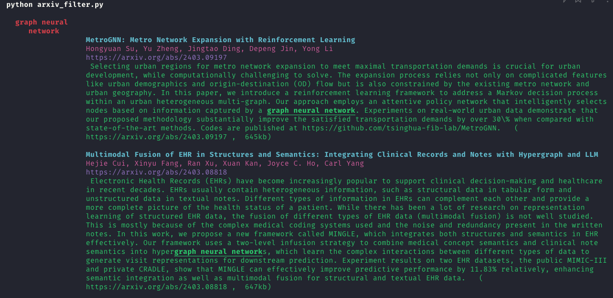

# Yet Another arXiv Filter

A hacky keyword/author search through daily arxiv emails. There are probably some edge cases this doesn't handle.



## Table of Contents

- [Installation](#installation)
- [Usage](#usage)
- [Contributing](#contributing)
- [Disclaimer](#license)

## Installation

1. Clone the repo.
2. `pip install rich` for pretty output. 

## Usage

1. Fill `keywords.txt` and `authors.txt` (one per line). Keywords are searched in the title and abstract.
2. Copy mail contents into `mail_text.txt`.
3. `python arxiv_filter.py`

For maximum efficiency, setup this alias:
```bash
alias arxiv="cd <path_to_repo> && open mail_text.txt && read -s -k '?Press any key to continue.' && python arxiv_filter.py"
```
Then all you need is to copy the main contents and press any key. 

## Contributing

Any feedback is welcome. 

## Disclaimer

The author(s) of this repository are not responsible for any potential loss of career opportunities due to missed arXiv papers. Use at your own risk.  